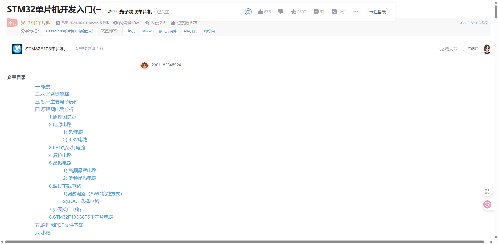
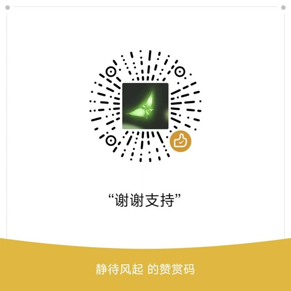

# CSDN沉浸式阅读插件 <small>v1.1</small>

一个让CSDN博客阅读体验更专注的Chrome扩展插件，自动移除页面干扰元素，优化阅读体验。

## 功能特点

- 自动移除侧边栏、工具栏等干扰元素
- 优化文章内容显示宽度，充分利用屏幕空间
- 支持浏览器打印功能（Ctrl+P）
- 无需额外操作，访问CSDN博客页面即自动生效

### V1.1新增功能

- 改用css注入而非直接移除元素，方便回退
- 可控开关，点击图标可以更换状态
- 开关记忆，插件会记住你上次的状态，下次访问页面时自动生效
- 添加快捷键（Ctrl+B）
- 把图标换成png（svg无法显示）

## 安装方法

1. 下载代码到本地
2. 打开Chrome浏览器，访问 `chrome://extensions/`
3. 开启右上角的"开发者模式"
4. 点击"加载已解压的扩展程序"，选择本插件目录

## 使用说明

安装后访问任何CSDN博客页面（如 `https://blog.csdn.net/*`），插件会自动：

1. 移除右侧推荐栏、广告等干扰内容
2. 调整文章主体宽度至全屏
3. 隐藏顶部工具栏

点击插件图标切换效果。

## 效果

使用效果

## 技术实现

- <del>使用Chrome扩展的content_scripts功能注入页面</del>
- <del>通过DOM操作移除指定元素</del>
- 使用CSS优化文章显示效果
- `commands`添加快捷键
- `tabs.onUpdated`API监听页面加载，并执行注入操作
- `storage`API存储插件状态
- `action`API控制插件图标
- `scripting.insertCSS`注入css

## 更新日志

- v1.1 (2025-07-04): 新增可控开关、快捷键功能、开关记忆功能
- v1.0 (2025-06-20): 初始版本发布

## 作者

由[ozif]开发，欢迎提交Issue和PR！
[github](https://github.com/ozif)
[bilibili](https://space.bilibili.com/646734220?spm_id_from=333.1007.0.0)

## 感谢打赏

